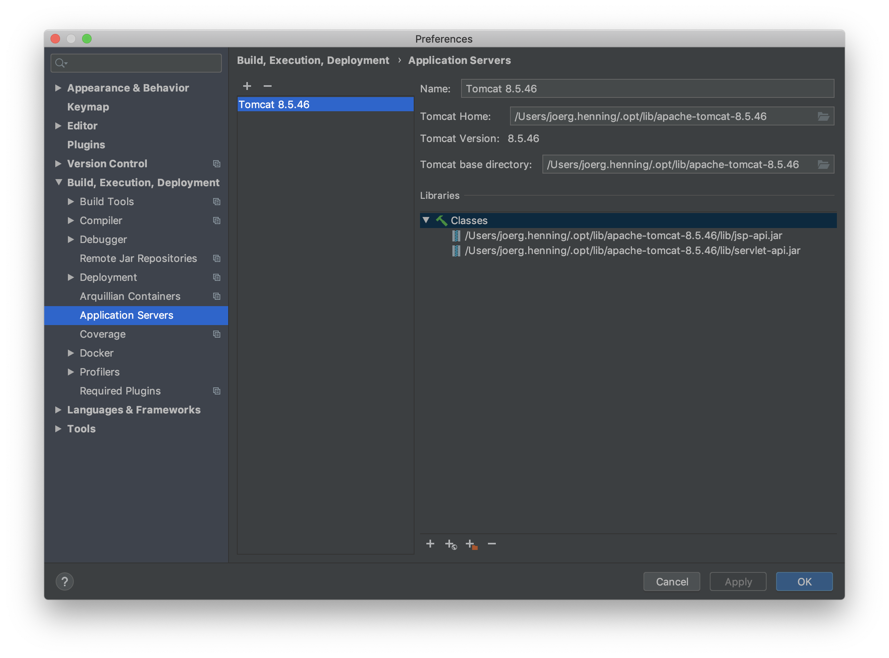
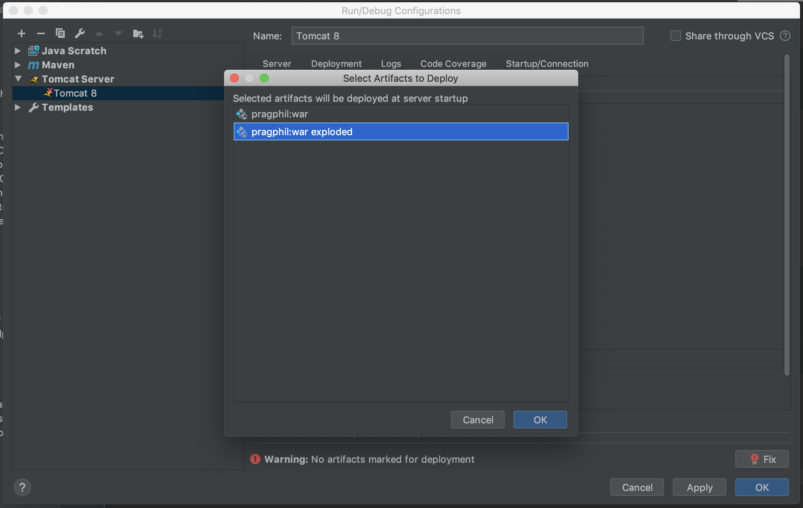
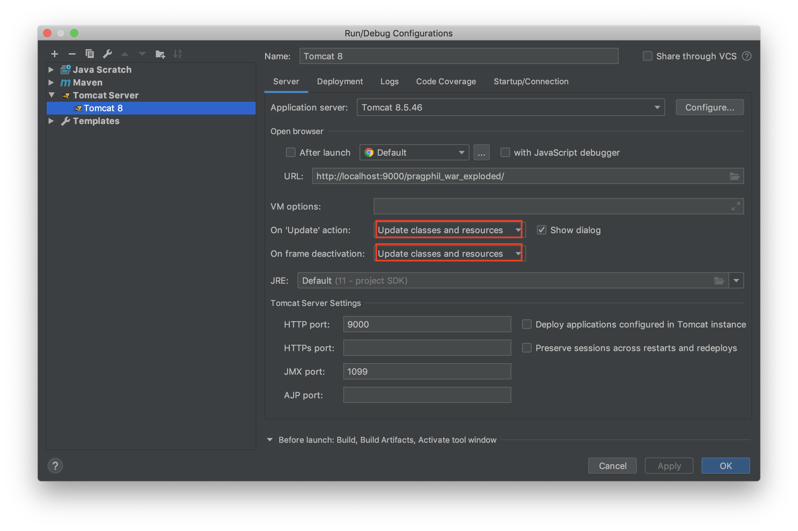

# The Pragmatic Philosopher

Best Philosopher management app on the web. Discover how ancient wisdom can lead to a better life for you and your 
favourite pet. 

Classic Spring WebMVC demo app, loosely based on [Chad Darbys Udemy course](https://www.udemy.com/spring-hibernate-tutorial)

## Run Locally Via Docker

Build maven package, then run `docker-compose`:

```sh
mvn clean package
docker-compose up --build
```

Or using `make`:

```sh
make clean run
```

This will boot the application using docker-compose, migrate and seed the database. You can then access the app at 
http://localhost:8080/pragphil/

For subsequent deploys, use the tomcat plugin:

```sh
mvn clean tomcat7:redeploy
```

A simple database administration app is built into the docker compose stack, it's available on http://localhost:8080/adminer

## Logging In

- Open the app at http://localhost:8080/pragphil/
- Login with one of the test users, e.g. `plato`, default password is `password` for all users
- Add/update users as you like, use [this bcrypt calculator](https://www.bcryptcalculator.com/) to generate passwords 

## Hot Reload & Debugging

- This does not work with Tomcat running in Docker, need a local Tomcat
- Useful for debugging, rapid feedback, e.g. when testing frontend changes

### Database

- Install & Postgres locally following the instructions for your respective OS
- Or only run the postgres container in docker compose:

```
$ docker-compose up postgres
```

- Either way, Postgres should be listening on `localhost:5432`
- Change JDBC url in [src/main/resources/datasource.properties]
- _Or_ update `/etc/hosts` like this:

```
127.0.0.1 postgres
```

### IntelliJ

- Based on [this article](https://www.mkyong.com/intellij/intellij-idea-auto-reload-a-web-application-hot-deploy/)
- Make sure "Tomcat and TomEE Integration" is enabled
- Go to _Preferences > Build, Execution, Deployment > Application Servers_
- Add a new Tomcat server, point to local Tomcat install



- Create a new Run Configuration
- Important: in Deployment tab, select _exploded war_



- Make sure settings match your Tomcat settings
- For frontend stuff, simply run it and edit files
- Changes should show up automatically


